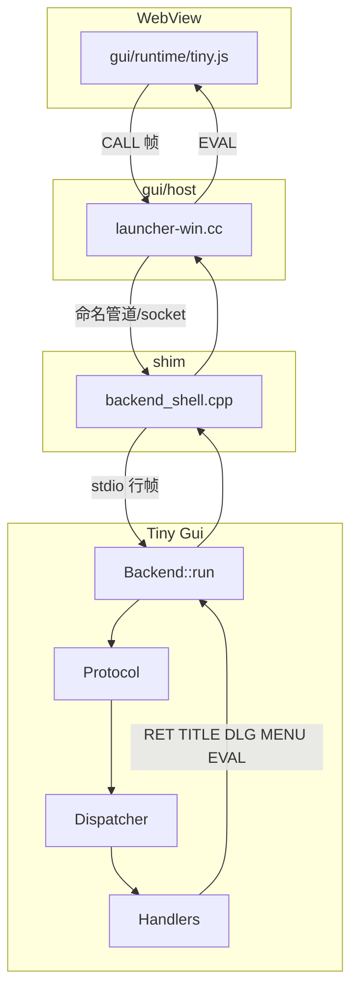
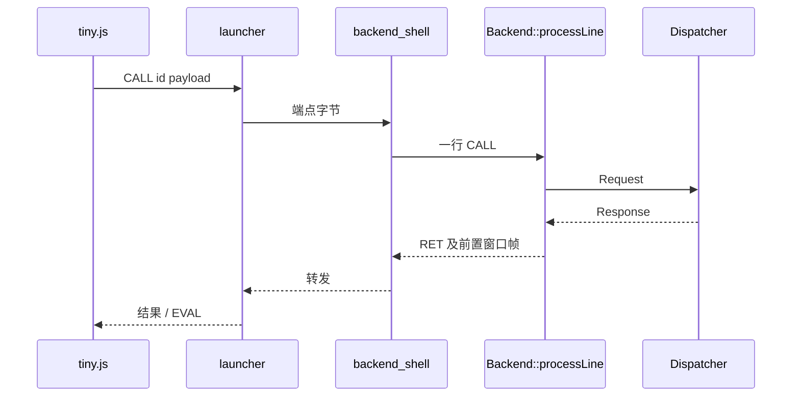

# 架构设计

## 概述

TypePHP GUI（仓库 `typephp-gui`，Composer 名 `yangweijie/typephp-gui`，`type: project`）是一套**桌面 GUI 应用模板**：用 [aot-compiler](https://github.com/layterz/aot-compiler)（`tpc`）把 PHP 编成原生后端，驱动已融合进本仓库的 [tinyjsapp](https://github.com/tarwin/tinyjsapp) 宿主（WebView2 / WebKit）。

目标用户是希望用 PHP 写桌面业务逻辑、同时沿用 tinyjsapp 页面 API（`window.tiny.*`）和行分隔帧协议的开发者。页面仍在 WebView 里跑；应答 `CALL`/`RET` 的不再是 txiki.js，而是编译后的 PHP（开发时也可用系统 PHP ≥ 8.1 跑同一套逻辑）。

关键架构特征：launcher 与 PHP **不能直接讲同一套 IPC**（Windows 命名管道、POSIX unix socket；php-nano 甚至没有 socket API），因此始终有一层 C++ **shim**（`shim/backend_shell.cpp`）把宿主端点转成后端的 **stdio 帧通道**。stdout 只走协议帧，stderr 只进 shim 日志。GUI 源码在 `gui/`，不再依赖外部 tinyjsapp checkout 或补丁。

## 技术栈

**语言与运行时**
- PHP ≥ 8.1（框架与 `bin/run-backend.php`；AOT 用 tpc，文档口径 v0.9.3）
- C++17（shim、Windows/Linux/macOS launcher）
- JavaScript（`gui/runtime/tiny.js`，嵌入 `tiny_client.h`）

**框架**
- 自研 `Tiny\Gui`（`gui/php/src/Tiny/Gui/`），无 Web 框架、无 Composer 运行时依赖
- 头less 协议测试：`gui/php/test/smoke.php`（`composer test` / `composer smoke`）

**数据存储**
- 无数据库。`StoreHandler` 为进程内数组；跨进程持久化需自行对接 `tinyjs.json` 等（代码未实现跨重启 store）

**基础设施**
- Windows：MSVC（`vcvars64`）编 PHP 后端；MinGW-w64 g++ 编 shim/launcher；WebView2 Runtime
- POSIX 验证：`test/posix/`（bash + gcc/g++ + python3）
- 打包校验：`tools/verify-bundle.py`

**外部服务**
- 构建 launcher 首次需联网下载 WinRT 头与 `WebView2.h`（之后缓存于 `build/`）
- 不调用云 API；页面 `tiny.api.call` 只打到本机后端

## 项目结构

```
typephp-gui/
├── src/backend.php              # 演示入口：Gui::serveDemo()
├── bin/run-backend.php          # 系统 PHP 跑同一后端（不编译）
├── composer.json                # project 模板 + PSR-4 Tiny\Gui\ + php smoke
├── gui/
│   ├── bin/tgui                 # dev / build / publish / init / status
│   ├── host/src/                # launcher-win.cc（含 --typephp）等
│   ├── runtime/tiny.js          # window.tiny 客户端
│   └── php/src/Tiny/Gui/        # Protocol / Dispatcher / Backend / AppRoot / Handlers
├── shim/backend_shell.cpp       # IPC ↔ stdio 帧泵
├── demo/                        # tinyjs.json + 前端示例
├── tools/                       # build-all.bat、build-launcher.sh、verify-bundle.py、e2e
├── test/posix/                  # POSIX 套件（独立可拷）
├── docs/                        # 调研与融合设计（非本 wiki）
├── experiments/                 # 历史探针，不参与构建
└── build/                       # 生成物（git 忽略）
```

**入口点**
- 演示 PHP：`src/backend.php` → `Tiny\Gui\Gui::serveDemo()`
- 空应用 PHP：`Gui::serve()` / `Gui::defaultDispatcher()`（无 `DemoApiHandler`）
- 帧泵：`Tiny\Gui\Backend::run()`（stdin/stdout）
- 开发 CLI：`gui/bin/tgui`
- 打包入口：`dist/<App>.exe`（shim），再拉 stock launcher 与 `php.exe`（AOT 后端）

## 子系统

### Tiny\Gui PHP 框架
**目的**: 解码 CALL、路由 method、编码 RET / 窗口帧 / EVAL / DLG  
**位置**: `gui/php/src/Tiny/Gui/`  
**关键文件**: `Protocol.php`, `Backend.php`, `Dispatcher.php`, `Gui.php`, `AppRoot.php`, `Handlers/*`  
**依赖**: PHP 8.1 stdlib；`bootstrap.php` 手工 require（tpc 编译期打进单文件）  
**被依赖**: `src/backend.php`、`gui/php/test/smoke.php`

### C++ shim
**目的**: 命名管道/unix socket ↔ 后端 stdio；排空 stderr，避免 64KB 管道堵死  
**位置**: `shim/backend_shell.cpp`  
**依赖**: launcher 拉起并交出端点；再拉起 `TYPEPHP_APP` / 打包后的 `php.exe`  
**被依赖**: `tgui dev` / `tgui build` 产物

### 原生宿主
**目的**: WebView 窗口、`--typephp`（dev）、stock `<html> <endpoint>`（packaged）  
**位置**: `gui/host/src/launcher-*.cc`  
**依赖**: WebView2（Windows）；`tiny.js` 经 `gen-client.sh` 嵌入  
**被依赖**: shim、页面 `window.tiny`

### tgui CLI
**目的**: 替代上游 `cli.js`：dev/build/publish/init/status  
**位置**: `gui/bin/tgui`  
**依赖**: 已构建的 launcher、shim、`app.exe`；`tinyjs.json`

### POSIX 验证套件
**目的**: 无窗口验证 shim 帧泵、启动模式、stderr 隔离  
**位置**: `test/posix/`  
**依赖**: bash（不在 Windows `composer test` 中）

## 图表





## 设计决策

- **必须有 shim**：PHP 打不开 Windows 命名管道；nano 无 socket。见根 `README.md`。
- **三条通道**：stdout=帧，stderr=诊断，stdin=入站帧。合并 stderr 会污染协议并可能堵死写端。
- **dev 与 packaged**：dev 用打了 `--typephp` 的 launcher 拉 shim；packaged 入口是 shim，再拉 **未补丁** launcher 的 `<html> <endpoint>` 契约。
- **空应用不含 DemoApi**：`defaultDispatcher` 只有 Core/Win/Menu/Store；演示用 `demoDispatcher` / `serveDemo()`。
- **listDir / fs.*** 限制在 `AppRoot`（`TYPEPHP_APP_ROOT` 或 `getcwd()`）。
